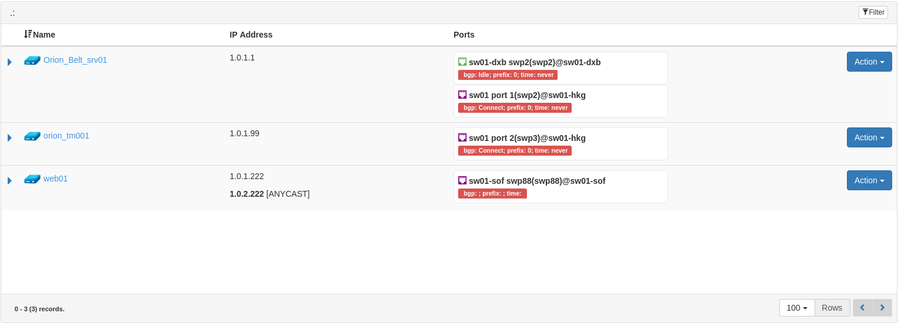
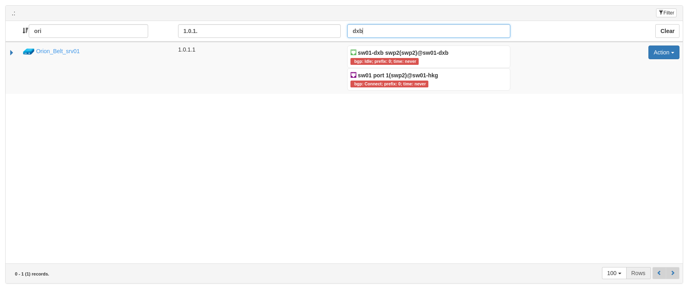
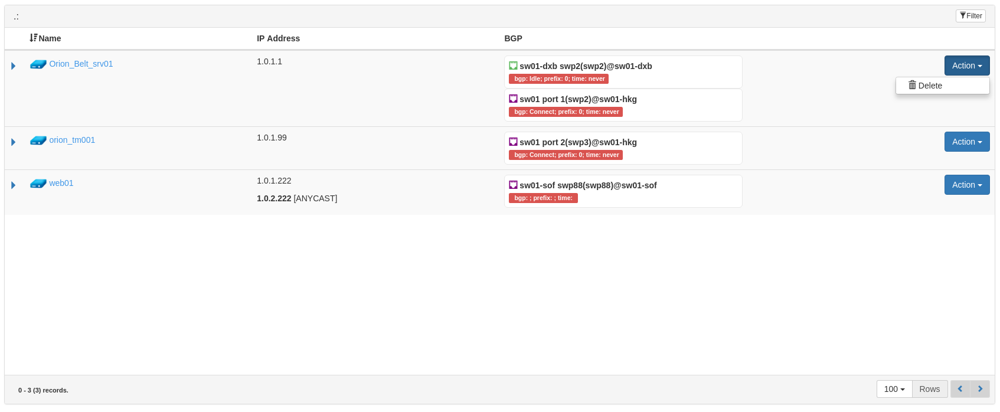
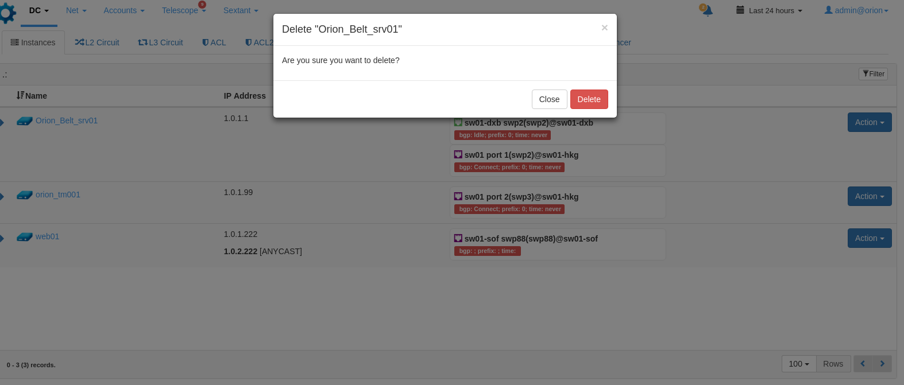

## Stack 
#
Accomplish the task using following stack
- Nodejs (express framework) on backend
- ReactJS and Bootstrap on frontend
- MariaDB or MySQL as a database

## How to send me the results
#
Once you have finished the project please send me the link of github project where you push the project's source codebase including the snapshot of the database in sql format. (tigran at xcloudnetworks.com)

## Task

Create a web page where servers list with their properties will be displayed. It should be represented as a table with following columns. Each column should be filterable.


* UI Table Columns
  - Name 
  - IP Address
  - Ports
  - Action

- **Name** is server name. 
- **IP Address** are the addresses that have been assigned to the server. The addresses can be *unicast* and *anycast*. If address is *anycast* than write down [ANYCAST] next to the ip address.
- **Ports** it is the physical ports name of the switch  that have been assigned to the server. The format of that it should be write down is -
*<port_description>(<port_name>)@<switch_name>*․ 
Each port also has properties related to BGP protocol states. The format of BGP state should be written down in following format  - *bgp: <bgp_state>; prefix: <prefix_count>; time: <uptime>*
- **Action**  button with dropdown menu with one sub-menu "Delete". OnClick show confirmation dialogue. Delete record from the database if user confirms to delete.


Allow to filter the server records in the table by specifying search condition for each column. The result of filtering should be generated based on the all search criteria.

### Screenshot of filtering the server by criterions 

### Screenshots of deleting the server




## Database structure

#
### Table *servers*
```
+----------+
|id | name |
+----------+
```
- id (integer primary key)
- name (varchar)


### Table *ip_assignments*

```
+-----------------------------------+
|id | ip_address | server_id | type | 
+-----------------------------------+
```
- id (integer primary key)
- ip_address (varchar)
- server_id  (integer)
- type (enumeration with values 'anycast', 'unicast')


### Table *bgp_states*

```
+----------------------------------------+
|id | port_id |state | uptime | prefix   | 
+----------------------------------------+
```
- id (integer primary key)
- port_id (integer)
- state  (varchar)
- uptime (varchar)
- prefix (integer)


### Table *ports*

```
+------------------------------+
|id | switch_id | name | desc  | 
+------------------------------+
```
- id (integer primary key)
- switch_id (integer)
- server_id (integer) 
- name  (varchar)
- desc (varchar)

### Table *switch*

```
+-----------+
|id | name  | 
+-----------+
```
- id (integer primary key)
- name (varchar)

### Fill out the tables with the data
There are 2 switches each of it has 10 ports. There are 3 servers. 2 servers from 3 are connected to one switch and the 3rd server is connected to both switches. Each server has minimum one unicast address attached to them and one of the servers has also an anycast ip address attached to it.

You are free to choose whatever name you want for switches and ports. You should figure out which fields are foreign keys.


## Graphical representation of the physical topology
#
```
                 +-----------+        +------------+
           port4 |           |        |            |port1
         +------> Switch1    |        | Switch2    <------------+
         |       +-------^---+        +------^-----+            |
         |               |port3              |port2             |
         |               |                   |                  |
         |               |                   |                  |
        +--------+       |                   |           +---------+
        |server1 |       |                   |           |server2  |
        |--------|       +---------+ +-------+           |---------|
        |        |                 | |                   |         |
        |        |                 | |                   |         |
        |        |              +--+-+-----+             |         |
        +--------+              |server3   |             +---------+
                                |----------|
                                |          |
                                |          |
                                |          |
                                +----------+
```